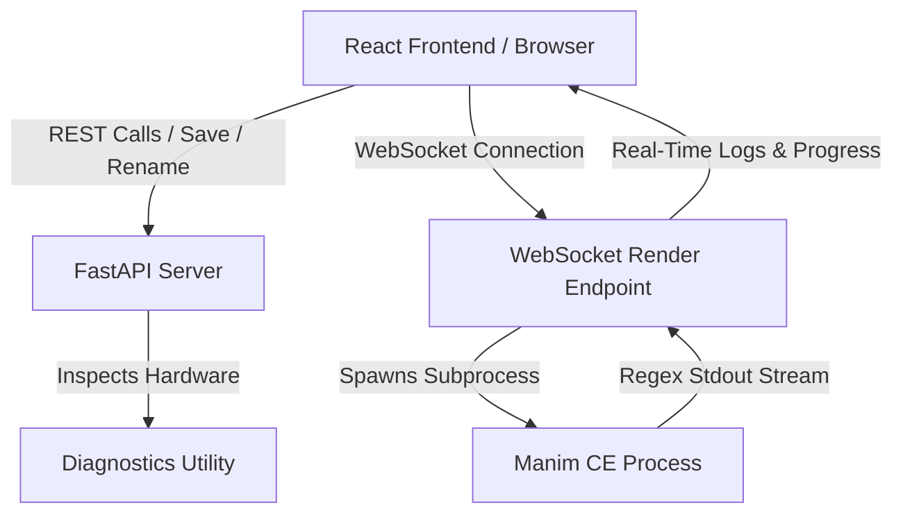

# Technical Project Reference

This document provides a detailed technical reference for the Manim Composer system. It explains the system architecture, API endpoints, backend modules, and frontend state management.

---

## 1. System Architecture

The application is structured as a decoupled full-stack project running locally:



- **Frontend**: A React 19 SPA bundled with Vite, styled with Tailwind CSS v4, utilizing Monaco Editor for script management and KaTeX for real-time mathematical equation visualization.
- **Backend**: A FastAPI server running on Uvicorn that acts as a process supervisor, file coordinator, and system hardware profiling engine.

---

## 2. Backend Modules & Reference

### A. Core Application Server (`backend/main.py`)
Responsible for routing, mounting static directories (`/media` and `/assets`), managing process lifecycles, and checking AST representations of scripts.
- **AST Parsing**: The backend utilizes the native Python `ast` module to read script code and return all scenes defined in the file (scanning for inherits/names) so they can be selected in the sidebar drop-down.

### B. Hardware & Environment Profiler (`backend/diagnostics.py`)
Inspects host hardware configurations to select rendering presets:
- **CPU**: Detects core and logical thread counts.
- **RAM**: Queries virtual memory totals.
- **GPU**: Uses `nvidia-smi` and PowerShell controllers to locate graphics models and VRAM limits.
- **Dependencies**: Locates local path executables (`manim`, `ffmpeg`, `latex`, `dvisvgm`).
- **Profiles**:
  - `eco`: Low quality (480p 15fps), aggressive caching, recommended threads count = 1.
  - `balanced`: Medium quality (720p 30fps), standard settings.
  - `workstation`: High quality (1080p 60fps), multithreaded FFMPEG encoding defaults.
- **Dynamic Config**: Automatically generates a custom `manim.cfg` file inside the workspace folder on backend startup to optimize output directories and thread limits.

### C. Subprocess Supervisor (`backend/executor.py`)
Executes the Manim command array:
```bash
manim <script_name> <scene_name> -q<quality> --progress_bar=display
```
- **Real-Time Stream Parsing**: Spawns an asynchronous process using `asyncio.create_subprocess_exec`. Concurrently reads stdout/stderr streams line-by-line, parsing progress percentages `[\s*(\d+)%]` and file output markers `File ready at\s+'([^']+)'`.
- **Process Trees Control**: On cancellation requests, it executes system-level process group terminations (`taskkill /F /T /PID` on Windows) to terminate the python compiler and its child renderers forcefully.

---

## 3. REST API Endpoint Reference

### `GET /api/diagnostics`
Returns system profiling settings and dependency statuses.
- **Response Format**:
  ```json
  {
    "profile": "workstation",
    "description": "High performance workstation...",
    "preview_quality": "1080p60",
    "default_fps": 60,
    "default_resolution": "1920x1080",
    "recommended_threads": 15,
    "opengl_supported": true,
    "hardware": { ... },
    "dependencies": {
      "manim": "C:\\tools\\Manim\\Scripts\\manim.EXE",
      "ffmpeg": "C:\\...",
      "latex": "Not Found",
      "dvisvgm": "Not Found",
      "latex_available": false
    }
  }
  ```

### `GET /api/files`
Scans and lists active workspace assets: scripts (`*.py`), asset imports (`*.svg`, `*.mp3`, etc.), and rendered video outputs (`*.mp4`, `*.webm`).

### `GET /api/file-content?filename=<name>`
Reads file code and returns parsed AST Scene classes.

### `POST /api/save`
Saves user edits from Monaco editor.
- **Request Body**: `{ "filename": "example.py", "code": "..." }`

### `POST /api/rename`
Renames an existing python script.
- **Request Body**: `{ "old_name": "example.py", "new_name": "new_name.py" }`

### `POST /api/upload-asset`
Accepts `multipart/form-data` uploads and writes assets to `workspace/assets/`.

### `POST /api/install-latex`
Spawns background subprocess `winget install --id MikTeX.MiKTeX --silent --accept-source-agreements --accept-package-agreements` to set up LaTeX tools on Windows.

---

## 4. WebSocket Rendering Protocol

Clients connect to `ws://localhost:8000/api/render`. Communication utilizes JSON frames:

### Client to Server Messages

#### Start Render
```json
{
  "type": "start",
  "filename": "example.py",
  "scene": "SquareToCircle",
  "quality": "m",
  "use_opengl": false
}
```

#### Cancel Render
```json
{
  "type": "cancel"
}
```

### Server to Client Messages

- **`log`**: Raw terminal lines. `{ "type": "log", "stream": "stdout/stderr", "message": "..." }`
- **`progress`**: Render percentage. `{ "type": "progress", "percent": 45 }`
- **`file_ready`**: Video compiled successfully. `{ "type": "file_ready", "filename": "SquareToCircle.mp4", "rel_path": "media/videos/..." }`
- **`result`**: End of rendering state. `{ "type": "result", "success": true, "status": "success" }`

---

## 5. Frontend Architecture & State

### State Management
All layout, active connections, files, and previews are driven by React hooks in `frontend/src/App.tsx`:
- **`autoRender`**: Flag to enable auto-render.
- **`autoRenderTimeoutRef`**: Tracks the debounced timer. Resets on Monaco editor typing. Spawns rendering processes after 2000ms from the last keystroke.
- **`startRenderRef`**: Synchronized callback reference to prevent stale closure loops inside debounced timeouts.
- **`renamingFile` / `renameValue`**: Manages inline double-click text field toggles inside the script file browser tab.
- **`savedPath`**: Displays the active workspace file directory under the Live Video Preview block.
