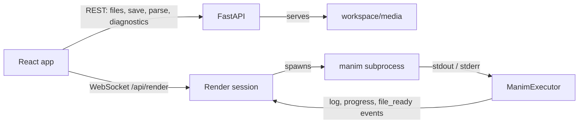

# Technical reference

How Manim Composer is put together: the backend modules, the REST API, the render WebSocket protocol, and the
frontend architecture.

## Architecture


```mermaid
graph LR
    UI[React app] -- REST: files, save, parse, diagnostics --> API[FastAPI]
    UI -- WebSocket /api/render --> WS[Render session]
    WS -- spawns --> M[manim subprocess]
    M -- stdout / stderr --> EX[ManimExecutor]
    EX -- log, progress, file_ready events --> WS
    API -- serves --> Media[workspace/media]
```

One process serves everything: the built frontend (`frontend/dist`), the API under `/api`, rendered output under
`/media`, and uploads under `/assets`. In development, the Vite dev server proxies those paths to the backend.

## Backend (`backend/`)

| Module               | Responsibility |
| -------------------- | -------------- |
| `main.py`            | Routes, the render WebSocket, temp-render bookkeeping, startup (directory creation, stale temp cleanup, `manim.cfg`). |
| `executor.py`        | `ManimExecutor` runs one Manim process, reads stdout/stderr in chunks (splitting on `\n` and `\r` so tqdm progress streams live), and turns lines into events. Cancels the whole process tree (`killpg` / `taskkill /T`). |
| `scene_parser.py`    | AST analysis: module-level `Scene` subclasses (including classes under `if`/`try`, aliased imports such as `from manim import Scene as S`, manim-slides `Slide`, and subclasses of scenes in the same file) and each scene's `self.play()` / `self.wait()` calls. Results are cached. |
| `origins.py`         | Origin and Host policy for HTTP and WebSocket requests (see [Security](#security)). |
| `diagnostics.py`     | CPU/RAM/GPU detection (cached for 5 minutes), dependency lookup (never cached), render profile, and `workspace/manim.cfg`. |
| `workspace_paths.py` | `safe_basename` / `safe_join`: reject traversal, absolute paths, and Windows device names. `validate_new_filename` adds the rules for names being created (see [File names](#file-names)). |

Manim runs with `COLUMNS=400` (so Rich doesn't wrap output paths), `PYTHONIOENCODING=utf-8`, `PYTHONUNBUFFERED=1`, and
`PYTHONDONTWRITEBYTECODE=1`. If `manim` isn't on `PATH` but the package is importable, the server runs
`python -m manim` instead.

### Render profiles

| Profile       | Chosen when                         | Default quality |
| ------------- | ----------------------------------- | --------------- |
| `eco`         | < 4 threads, < 6 GB RAM, or a container | 480p15 |
| `balanced`    | ≤ 8 threads and ≤ 16 GB RAM          | 720p30 |
| `workstation` | anything bigger                      | 1080p60 |

The profile only sets the default quality in the UI; renders always pass an explicit `-q` flag.

## REST API

All endpoints return JSON. Errors use FastAPI's `{"detail": "..."}` shape.

| Method & path | Body / query | Returns |
| ------------- | ------------ | ------- |
| `GET /api/health` (`/api/status`) | — | `{status, service, version}` |
| `GET /api/diagnostics` | — | Profile, hardware, `platform`, `python_version`, `max_code_bytes` (the server's `MANIM_MAX_CODE_BYTES`; the frontend uses it for its size check and falls back to 2 MB), and `dependencies` (`manim`, `ffmpeg`, `latex`, `dvisvgm` paths or `"Not Found"`, plus `latex_available`). |
| `GET /api/files` | — | `{scripts, assets, media}`. On first setup only, seeds `example.py` into an empty workspace and writes `workspace/.composer-initialized`; deleting `example.py` later is permanent. Also removes download-only outputs nobody fetched within `MANIM_TEMP_DOWNLOAD_TTL` seconds. Media items: `name, size, type ("video"\|"image"), url, path, script, scene, quality, modified`, newest first. |
| `GET /api/file-content` | `?filename=` | `{filename, code, version, scenes, animations, syntax_error?}`. Works for existing files whose names the [file name rules](#file-names) now forbid. 403 when the server may not read the file (e.g. mode 0000). |
| `POST /api/parse-code` | `{code}` | `{scenes, animations, syntax_error?}` without touching disk. `syntax_error` is `{message, line, column}` when the code doesn't parse. |
| `POST /api/save` | `{filename, code, base_version?, create_only?}` | `{success, filename, message, version, scenes, animations, syntax_error?}`. `filename` is the name actually stored (see [Saving and versions](#saving-and-versions)). |
| `POST /api/rename` | `{old_name, new_name}` | `{success, old_name, new_name, message}`; handles case-only renames. `new_name` is normalized like a save name and follows the [file name rules](#file-names). 400 when `new_name` is invalid or another file already has exactly that name, 404 when `old_name` doesn't exist, 409 when another file differs from `new_name` only by letter case or Unicode form. `old_name` may be a legacy name the rules now forbid. |
| `DELETE /api/scripts` | `?filename=` | `{success, filename}`. Deletes a script; 404 when it doesn't exist, **409** while a save or rename of that name is in progress, or when a rename created that name after the delete request arrived (try again). For a [link entry](#links-in-the-workspace) that points outside the workspace or nowhere, removes the link itself (`link_removed: true`), never its target. |
| `POST /api/upload-asset` | multipart `file`, `?overwrite=` | `{filename, url, replaced}`; images, SVG, audio, and fonts up to 50 MB. If the name exists the server answers 409 ("Confirm to replace it…"); send the upload again with `overwrite=true` to replace it. Without `overwrite` the file is created exclusively, so of several uploads racing for one new name exactly one wins and the rest get 409. `replaced` is true only when a file was actually overwritten. 403 when the existing file is read-only. The upload is written to `assets/<name>.uploading-<hex>` first and moved into place when complete; those partial files are never listed or served, and the startup cleanup removes leftovers (`MANIM_UPLOAD_PARTIAL_AGE`). |
| `DELETE /api/assets` | `?filename=` | Deletes an upload |
| `DELETE /api/media` | `?path=` (relative to `workspace/media`) | Deletes a render and its cached chunks |
| `GET /api/download-temp` | `?path=` | Serves a download-only render once, then deletes it |
| `POST /api/install-manim` \| `-latex` \| `-ffmpeg` | — | Starts `pip install manim` or a `winget` install in the background. Refused (403) in containers or with `MANIM_ALLOW_INSTALLS=0`. |

`animations` maps scene names to steps: `{type: "play" | "wait", label, line, duration?, estimated?, alternative?, repeat?,
loop_line?, loops?}`. `duration` is a number of seconds when it is a literal, otherwise the expression's source text; `estimated`
marks Manim's default used as a guess, or a step in a branch inside a loop (below). Steps inside `for`/`while` loops or comprehensions (`[self.play(x) for x in
(a, b)]`) also carry `repeat` (total runs: the product of the enclosing loop counts, so a `range(0)` anywhere gives 0;
`null` when a count is only known at runtime, e.g. a `while` loop, a loop over a variable, or a comprehension with
`if`), `loop_line` (the outermost loop), and `loops`: `[[line, column, count|null], ...]` from the outermost loop
inward. The UI uses `loops` to replay a loop body in execution order (`a, b, a, b, …`) when mapping progress to steps.
Inside a loop, only one branch of an `if`/`elif`/`else` or `match`/`case` runs per pass, so only one is counted: the
branch with the most animation runs (nested branches and inner loops included; the first on a tie; an `if` without
`else` or a `match` without `case _` also has an empty branch). All steps in those branches get `estimated: true`, and
the steps of the branches not counted also get `alternative: true`: they stay in the list (source order) but the UI
leaves them out of the total, the animation count and the execution order. Branches outside loops are all counted.
Scenes defined inside `if`/`try`/`with`/loop/`match`-`case` blocks at module level are found too.

### Saving and versions

- `version` is an opaque hash of the file's bytes, returned by `GET /api/file-content` and every save.
- Send it back as `base_version` to save only if nobody changed the file since: **412** when the file on disk has a
  different version (changed in another tab or program), **404** when it was renamed or deleted (a save with
  `base_version` never recreates it). Without `base_version` the save always writes.
- `create_only: true` (New script dialogs) never overwrites: **409** `"<name> already exists."`.
- **409** also when another file differs only by letter case or Unicode normalization
  (`'Intro.py' already exists. File names that differ only by case are not allowed.`).
- **403** `"This file is read-only; change its permissions to save it."` when the existing file is not writable by the
  server (no owner-write bit, or `os.access(W_OK)` fails); the file is left untouched and its permissions are never
  changed. Unreadable files (mode 0000) get the same 403 instead of a 500.
- **400** for an invalid name (`Invalid script filename: <reason>`), or `Rename this file to save or render it:
  <reason>` when the file already exists under a name the rules now forbid. **413** when the UTF-8 code exceeds
  `MANIM_MAX_CODE_BYTES`.
- The stored name is normalized first: Unicode NFC and exactly one lowercase `.py` (`Foo.PY` → `Foo.py`, `intro` →
  `intro.py`). The response's `filename` is that stored name.

## Render WebSocket: `/api/render`

Each connection has its own executor, so tabs never interfere. All frames are JSON.

### Client → server

```json
{ "type": "start", "id": "c0ffee", "filename": "example.py", "scene": "Intro",
  "quality": "m", "use_opengl": false, "download_only": false, "code": "..." }
```

- `quality` is one of `l`, `m`, `h`, `k`.
- `code` is optional. When present (unsaved buffer or browser storage) the server renders a scratch copy named
  `_temp_run_<hex>.py`, rewrites that name to `filename` in logs and tracebacks, and moves the output into the
  script's own media folder afterwards.
- `download_only` renders to a scratch folder and returns a one-time `/api/download-temp` URL. If the link is never
  fetched, the folder is removed at the next server start or after `MANIM_TEMP_DOWNLOAD_TTL` seconds (default 3600);
  a render that is still running is never swept.
- `filename` follows the [file name rules](#file-names), and `_temp_run_*` names are refused. An existing file whose
  name the rules now forbid is refused with `Rename this file to save or render it: <reason>`.
- A new `start` while a render is running cancels the old one.
- Before Manim starts, the server checks the code. It refuses the render (an `error` event, then `result` with
  `status: "rejected"`) only on a syntax error (`Syntax error on line N: …`), when the file defines no class at all
  (`No Scene class found…`), or when `scene` is not defined anywhere in the file (`Scene 'X' is not in this file.
  Found: …`). A class the parser can't prove is a Scene (a factory-made base, for example) is passed to Manim with an
  `info` note; if Manim then writes no video or image, the render fails with "Manim finished without writing a video
  or image".
- Renders are queued: only `MANIM_MAX_CONCURRENT_RENDERS` (default 1) run at once. A render that has to wait gets a
  `queued` event (plus the same text as an `info` line for older clients) and, when a slot frees up, a `started`
  event. A `cancel` while queued ends it with a `cancelled` result without starting Manim.

```json
{ "type": "cancel" }
```

### Server → client

Every event produced for a render carries `render_id` (the `id` from `start`). Clients should ignore events whose
`render_id` doesn't match the render they're waiting for.

| `type` | Fields | Meaning |
| ------ | ------ | ------- |
| `info` | `message` | Lifecycle notes. The first is the command line, prefixed with `$ `. |
| `queued` | `position`, `message` | The render is waiting for a free slot; `position` 1 is next. Sent when it starts waiting. |
| `started` | `waited` | A queued render got its slot and is starting (only sent after `queued`). |
| `log` | `stream` (`stdout`/`stderr`), `message` | One line of Manim output, with Rich's source-location column removed. |
| `progress` | `percent`, `animation?`, `label?` | Progress of the current animation (`animation` is the zero-based play/wait index). |
| `file_ready` | `url`, `rel_path`, `filename`, `kind` (`video`/`image`), `is_temp_download?` | The output file. |
| `latex_error_warning` | `message` | LaTeX seems missing or broken (sent at most once per render). |
| `status` | `status`, `message` | `success`, `failed`, or `cancelled`. |
| `error` | `message` | A problem. If it carries a `render_id`, a `result` follows. |
| `result` | `success`, `status`, `details` | Always the last event of a render. `status` is `success`, `failed`, `cancelled`, `timeout`, `error`, or `rejected` (invalid request). `details` is the executor's result; for a render stopped before it could report itself (cancelled while queued or preparing) it is `{success: false, status: "cancelled", reason}` with `reason` one of `cancelled` (a `cancel` message), `superseded` (a new `start`), `disconnected`, or `error`. |

Every `start` receives exactly one `result`.

## Security

The server executes arbitrary Python, so it has to make sure only the user's own pages can drive it:

- **Origin:** HTTP requests and WebSocket handshakes that carry an `Origin` header are accepted only from loopback
  origins (`localhost`, `*.localhost`, `127.0.0.1`, `[::1]`) on the server's own port or on a configured dev port
  (`MANIM_DEV_ORIGIN_PORTS`, default `5173,8000`), the server's own origin when it is addressed by IP with
  `MANIM_ALLOW_LAN=1`, or origins in `MANIM_ALLOWED_ORIGINS`. A page on any other localhost port is refused.
  Requests without an `Origin` (curl, scripts) pass this check.
  CORS headers are granted by the same policy.
- **Host:** the `Host` header must be a loopback name, an IP address (with `MANIM_ALLOW_LAN=1`), or the host of an
  allowed origin. This blocks DNS rebinding, where a hostile domain resolves to `127.0.0.1` and then makes same-origin
  requests without `Origin`. It is parsed strictly (`origins.parse_host_header`): `name[:port]` or `[IPv6][:port]`,
  where the port is 1–65535 in ASCII digits and nothing follows it. `127.0.0.1:8100.evil.com`, `localhost:abc`,
  `localhost:0`, `127.0.0.1:`, `[::1]:`, an empty Host, spaces, user info, paths and non-ASCII names get 403. A
  request with no Host header at all (HTTP/1.0) passes. Names are case-insensitive (`LOCALHOST:8100` is fine).
- **Request bodies:** besides the size caps, a body that stalls for `MANIM_BODY_TIMEOUT` seconds (default 30) or takes
  longer than `MANIM_BODY_DEADLINE` in total (default 120, 5 × for uploads) is answered with 408.
- File names go through `safe_basename` / `safe_join`; media deletion is limited to `videos/` and `images/` and
  refuses `..` segments.
- Events never carry `abs_path`. In Manim's log lines the workspace prefix is removed (paths are shown relative to
  the workspace), and site-packages, the standard library, the virtualenv root, the temp folder, and the home folder
  become `<site-packages>`, `<python-lib>`, `<venv>`, `<tmp>`, and `~`. Other absolute paths can still appear, such
  as a LaTeX or ffmpeg location or a file your script opens elsewhere. API error messages don't include host paths.
- Script size: `MANIM_MAX_CODE_BYTES` (default 2 MB) is measured on the code as UTF-8. The raw request body or
  WebSocket message has a separate, larger cap (`MANIM_MAX_REQUEST_BYTES`, default 6 × the code limit + 64 KB) so that
  JSON escaping can't push a valid script over the limit.

### File names

One rule, implemented identically in `backend/workspace_paths.py` (`to_script_name`, `validate_new_filename`) and
`frontend/src/lib/format.ts` (`toScriptName`, `validateScriptName`), with shared test vectors in
`tests/fixtures/filename_rules.json`.

Script names are normalized before they are checked or stored: Unicode NFC, and exactly one lowercase `.py`
(`Foo.PY` → `Foo.py`, `intro` → `intro.py`). The server never trims; the UI trims what you type and collapses a
pasted `intro.py.py`.

Names being created (save, rename target, upload, render `filename`) must:

- be a single name (no folders, `/` or `\`, no drive letter), at most 255 UTF-8 bytes, with at most 100 characters
  before the extension and something other than dots there (`..py` and `...` are refused);
- not start with a space, `-` or `.`, end with a space or dot, or have a space or dot right before `.py`
  (`x.py.`, `x.py `, `x .py`, `x..py` are refused);
- not contain `< > : " | ? *`, control characters, or invisible formatting characters such as U+202E;
- be in Unicode NFC (save and rename normalize for you; uploads are stored in NFC);
- not be a Windows device name (`CON`, `PRN`, `AUX`, `NUL`, `CONIN$`, `CONOUT$`, `COM0`–`COM9`, `LPT0`–`LPT9`, also with
  an extension), checked on the NFKC form, so `COM¹.py`, `ＣＯＭ１.py` and `COM١.py` count too;
- not differ from an existing file only by letter case or Unicode normalization (409; compared as NFC + lower case,
  so `café.py` NFC vs NFD collide, `straße.py` and `STRASSE.py` don't);
- not start with `_temp_run_` (any case) for scripts; that prefix is reserved for scratch renders.

"Space" means any Unicode space (Python's `str.isspace()`: NBSP, U+2000–U+200A, U+202F, U+205F, U+3000, …),
so `\u00a0x.py` and `x\u3000.py` are refused for new names; spaces inside the name are fine. U+2028/U+2029 (line and
paragraph separators) count as invisible characters.

Existing files with older, looser names (`-old.py`, `x .py`, `COM¹.py`, an NFD name) can still be listed, opened, renamed, and
deleted. Saving or rendering one answers `Rename this file to save or render it: <reason>` (400 / a rejected render),
and the UI shows that message. Invalid names get a 400 with the reason and never echo a host path.

### Links in the workspace

`GET /api/files` lists a script that is a symbolic link pointing outside the workspace with `outside: true`, and a
link whose target doesn't exist with `broken: true` (size 0). Such entries can't be opened, saved, renamed or
rendered (a render answers an `error` event and a `rejected` result, without reading the file); the UI shows them
greyed out with only a Delete button, and `DELETE /api/scripts` removes the link itself, never the file it points to.
Links to files inside the workspace behave like the file.

### Startup cleanup

Once the server has bound its port, it removes scratch renders and leftover save temp files older than
`MANIM_SWEEP_MIN_AGE`, and interrupted uploads older than `MANIM_UPLOAD_PARTIAL_AGE`. "Bound" is checked with
psutil; if psutil can't list sockets (missing, or AccessDenied as on macOS without root), the server scans its own
file descriptors on Linux; if neither works it logs a warning and sweeps 5 s after startup, unless the server has
already shut down (a second instance on a busy port exits before that and never sweeps).

## Frontend (`frontend/src/`)

| Path | Contents |
| ---- | -------- |
| `App.tsx` | Composes the layout and wires hooks to components; owns render orchestration (save → parse → start), auto-render, shortcuts, and dialogs. |
| `hooks/useWorkspace.ts` | Files, the editor buffer, per-file unsaved drafts, debounced scene parsing, and file operations for both storage modes. |
| `hooks/useRenderSession.ts` | The render WebSocket: reconnect with backoff, queued start while connecting (8 s timeout), `render_id` filtering. |
| `hooks/useDiagnostics.ts` | Server reachability, the hardware profile, and installer polling. |
| `hooks/useLogs.ts` | Console buffer that commits once per animation frame (Manim can print hundreds of lines a second). |
| `components/` | `layout/` (top bar, activity bar, status bar), `editor/`, `preview/`, `console/`, `sidebar/` panels, `dialogs/`, and `ui/` primitives built on Radix. |
| `lib/` | API client, types, templates, shape-builder code generator, formatting, log line references, localStorage helpers, and the trimmed Monaco build (`monacoCore.ts`). |
| `index.css` | Design tokens (`@theme`): surfaces, text, Manim BLUE accent, and Manim GREEN/GOLD/RED for status. |

Monaco and the LaTeX panel (KaTeX) are lazy-loaded, so the initial bundle stays around 170 KB gzipped.

### Preferences (localStorage)

Keys are prefixed `mc.`: storage mode, quality, save-before-render, download-only, OpenGL, auto-render, loop preview,
editor font size, the open sidebar view, the last open file per storage mode, the selected scene per file, and
browser-stored scripts. Pane sizes are remembered by `react-resizable-panels`. Keys from earlier versions are migrated
on first read.

## Tests

- `tests/` — pytest suite for the API, executor, parser, origin policy, paths, and diagnostics.
  `test_e2e_real_render.py` drives real renders through the WebSocket and is skipped when Manim isn't installed.
- `frontend/src/**/*.test.ts(x)` — Vitest + Testing Library. `src/test/` provides a fake backend (`fakeServer.ts`), a
  scriptable WebSocket (`fakeSocket.ts`), and a textarea stand-in for Monaco (`fakeEditor.tsx`).
