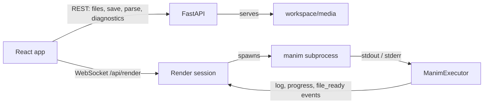

# Technical reference

How Manim Composer is put together: the backend modules, the REST API, the render WebSocket protocol, and the
frontend architecture.

## Architecture


```mermaid
graph LR
    UI[React app] -- REST: files, save, parse, diagnostics --> API[FastAPI]
    UI -- WebSocket /api/render --> WS[Render session]
    WS -- spawns --> M[manim subprocess]
    M -- stdout / stderr --> EX[ManimExecutor]
    EX -- log, progress, file_ready events --> WS
    API -- serves --> Media[workspace/media]
```

One process serves everything: the built frontend (`frontend/dist`), the API under `/api`, rendered output under
`/media`, and uploads under `/assets`. In development, the Vite dev server proxies those paths to the backend.

## Backend (`backend/`)

| Module               | Responsibility |
| -------------------- | -------------- |
| `main.py`            | Routes, the render WebSocket, temp-render bookkeeping, startup (directory creation, stale temp cleanup, `manim.cfg`). |
| `executor.py`        | `ManimExecutor` runs one Manim process, reads stdout/stderr in chunks (splitting on `\n` and `\r` so tqdm progress streams live), and turns lines into events. Cancels the whole process tree (`killpg` / `taskkill /T`). |
| `scene_parser.py`    | AST analysis: module-level `Scene` subclasses (including classes under `if`/`try`, aliased imports such as `from manim import Scene as S`, manim-slides `Slide`, and subclasses of scenes in the same file) and each scene's `self.play()` / `self.wait()` calls. Results are cached. |
| `origins.py`         | Origin and Host policy for HTTP and WebSocket requests (see [Security](#security)). |
| `diagnostics.py`     | CPU/RAM/GPU detection (cached for 5 minutes), dependency lookup (never cached), render profile, and `workspace/manim.cfg`. |
| `workspace_paths.py` | `safe_basename` / `safe_join`: reject traversal, absolute paths, and Windows device names. `validate_new_filename` adds the rules for names being created (see [File names](#file-names)). |

Manim runs with `COLUMNS=400` (so Rich doesn't wrap output paths), `PYTHONIOENCODING=utf-8`, `PYTHONUNBUFFERED=1`, and
`PYTHONDONTWRITEBYTECODE=1`. If `manim` isn't on `PATH` but the package is importable, the server runs
`python -m manim` instead.

### Render profiles

| Profile       | Chosen when                         | Default quality |
| ------------- | ----------------------------------- | --------------- |
| `eco`         | < 4 threads, < 6 GB RAM, or a container | 480p15 |
| `balanced`    | ≤ 8 threads and ≤ 16 GB RAM          | 720p30 |
| `workstation` | anything bigger                      | 1080p60 |

The profile only sets the default quality in the UI; renders always pass an explicit `-q` flag.

## REST API

All endpoints return JSON. Errors use FastAPI's `{"detail": "..."}` shape.

| Method & path | Body / query | Returns |
| ------------- | ------------ | ------- |
| `GET /api/health` (`/api/status`) | — | `{status, service, version}` |
| `GET /api/diagnostics` | — | Profile, hardware, `platform`, `python_version`, `max_code_bytes` (the server's `MANIM_MAX_CODE_BYTES`; the frontend uses it for its size check and falls back to 2 MB), and `dependencies` (`manim`, `ffmpeg`, `latex`, `dvisvgm` paths or `"Not Found"`, plus `latex_available`). |
| `GET /api/files` | — | `{scripts, assets, media}`. On first setup only, seeds `example.py` into an empty workspace and writes `workspace/.composer-initialized`; deleting `example.py` later is permanent. Also removes download-only outputs nobody fetched within `MANIM_TEMP_DOWNLOAD_TTL` seconds. Media items: `name, size, type ("video"\|"image"), url, path, script, scene, quality, modified`, newest first. |
| `GET /api/file-content` | `?filename=` | `{filename, code, scenes, animations}` |
| `POST /api/parse-code` | `{code}` | `{scenes, animations, syntax_error?}` without touching disk. `syntax_error` is `{message, line, column}` when the code doesn't parse. |
| `POST /api/save` | `{filename, code}` | `{filename, scenes, animations, syntax_error?}` (adds `.py` if missing). 400 for an invalid name, 409 when a file differing only by case exists, 413 when the UTF-8 code exceeds `MANIM_MAX_CODE_BYTES`. |
| `POST /api/rename` | `{old_name, new_name}` | `{old_name, new_name}`; handles case-only renames. The new name follows the [file name rules](#file-names); 409 if it exists (in any letter case). |
| `DELETE /api/scripts` | `?filename=` | Deletes a script |
| `POST /api/upload-asset` | multipart `file`, `?overwrite=` | `{filename, url, replaced}`; images, SVG, audio, and fonts up to 50 MB. If the name exists the server answers 409 ("Confirm to replace it…"); send the upload again with `overwrite=true` to replace it. `replaced` is true only when a file was actually overwritten. |
| `DELETE /api/assets` | `?filename=` | Deletes an upload |
| `DELETE /api/media` | `?path=` (relative to `workspace/media`) | Deletes a render and its cached chunks |
| `GET /api/download-temp` | `?path=` | Serves a download-only render once, then deletes it |
| `POST /api/install-manim` \| `-latex` \| `-ffmpeg` | — | Starts `pip install manim` or a `winget` install in the background. Refused (403) in containers or with `MANIM_ALLOW_INSTALLS=0`. |

`animations` maps scene names to steps: `{type: "play" | "wait", label, line, duration?}`. `duration` is a number of
seconds when it is a literal, otherwise the expression's source text.

## Render WebSocket: `/api/render`

Each connection has its own executor, so tabs never interfere. All frames are JSON.

### Client → server

```json
{ "type": "start", "id": "c0ffee", "filename": "example.py", "scene": "Intro",
  "quality": "m", "use_opengl": false, "download_only": false, "code": "..." }
```

- `quality` is one of `l`, `m`, `h`, `k`.
- `code` is optional. When present (unsaved buffer or browser storage) the server renders a scratch copy named
  `_temp_run_<hex>.py`, rewrites that name to `filename` in logs and tracebacks, and moves the output into the
  script's own media folder afterwards.
- `download_only` renders to a scratch folder and returns a one-time `/api/download-temp` URL. If the link is never
  fetched, the folder is removed at the next server start or after `MANIM_TEMP_DOWNLOAD_TTL` seconds (default 3600);
  a render that is still running is never swept.
- `filename` follows the [file name rules](#file-names), and `_temp_run_*` names are refused.
- A new `start` while a render is running cancels the old one.
- Before Manim starts, the server checks the code. It refuses the render (an `error` event, then `result` with
  `status: "rejected"`) only on a syntax error (`Syntax error on line N: …`), when the file defines no class at all
  (`No Scene class found…`), or when `scene` is not defined anywhere in the file (`Scene 'X' is not in this file.
  Found: …`). A class the parser can't prove is a Scene (a factory-made base, for example) is passed to Manim with an
  `info` note; if Manim then writes no video or image, the render fails with "Manim finished without writing a video
  or image".
- Renders are queued: only `MANIM_MAX_CONCURRENT_RENDERS` (default 1) run at once. A render that has to wait gets an
  `info` event "Waiting for another render to finish…" and starts when a slot frees up.

```json
{ "type": "cancel" }
```

### Server → client

Every event produced for a render carries `render_id` (the `id` from `start`). Clients should ignore events whose
`render_id` doesn't match the render they're waiting for.

| `type` | Fields | Meaning |
| ------ | ------ | ------- |
| `info` | `message` | Lifecycle notes. The first is the command line, prefixed with `$ `. |
| `log` | `stream` (`stdout`/`stderr`), `message` | One line of Manim output, with Rich's source-location column removed. |
| `progress` | `percent`, `animation?`, `label?` | Progress of the current animation (`animation` is the zero-based play/wait index). |
| `file_ready` | `url`, `rel_path`, `filename`, `kind` (`video`/`image`), `is_temp_download?` | The output file. |
| `latex_error_warning` | `message` | LaTeX seems missing or broken (sent at most once per render). |
| `status` | `status`, `message` | `success`, `failed`, or `cancelled`. |
| `error` | `message` | A problem. If it carries a `render_id`, a `result` follows. |
| `result` | `success`, `status`, `details` | Always the last event of a render. `status` is `success`, `failed`, `cancelled`, `timeout`, `error`, or `rejected` (invalid request). |

Every `start` receives exactly one `result`.

## Security

The server executes arbitrary Python, so it has to make sure only the user's own pages can drive it:

- **Origin:** HTTP requests and WebSocket handshakes that carry an `Origin` header are accepted only from loopback
  origins (`localhost`, `*.localhost`, `127.0.0.1`, `[::1]`) on the server's own port or on a configured dev port
  (`MANIM_DEV_ORIGIN_PORTS`, default `5173,8000`), the server's own origin when it is addressed by IP with
  `MANIM_ALLOW_LAN=1`, or origins in `MANIM_ALLOWED_ORIGINS`. A page on any other localhost port is refused.
  Requests without an `Origin` (curl, scripts) pass this check.
  CORS headers are granted by the same policy.
- **Host:** the `Host` header must be a loopback name, an IP address, or the host of an allowed origin. This blocks
  DNS rebinding, where a hostile domain resolves to `127.0.0.1` and then makes same-origin requests without `Origin`.
- File names go through `safe_basename` / `safe_join`; media deletion is limited to `videos/` and `images/` and
  refuses `..` segments.
- Events never carry `abs_path`, and the workspace's absolute path is removed from Manim's log lines (paths are shown
  relative to the workspace). Other absolute paths Manim prints can still appear, such as the Python install or
  site-packages in a traceback, a LaTeX or ffmpeg location, or a file your script opens outside the workspace.
  API error messages don't include host paths.
- Script size: `MANIM_MAX_CODE_BYTES` (default 2 MB) is measured on the code as UTF-8. The raw request body or
  WebSocket message has a separate, larger cap (`MANIM_MAX_REQUEST_BYTES`, default 6 × the code limit + 64 KB) so that
  JSON escaping can't push a valid script over the limit.

### File names

Names being created (save, rename target, upload, render `filename`) must:

- be a single name (no folders, `/` or `\`), at most 255 UTF-8 bytes, with at most 100 characters before the
  extension and something other than dots there (`..py` and `...` are refused);
- not start with `-` or `.`, end with a space or dot, or contain `< > : " | ? *`, control characters, or invisible
  formatting characters such as U+202E;
- not be a Windows device name (`CON`, `PRN`, `AUX`, `NUL`, `COM0`–`COM9`, `LPT0`–`LPT9`, also with an extension);
- not differ only by letter case from an existing file (409);
- not start with `_temp_run_` (any case) for scripts; that prefix is reserved for scratch renders.

Existing files with older, looser names can still be opened, renamed, and deleted. Invalid names get a 400 with the
reason and never echo a host path.

## Frontend (`frontend/src/`)

| Path | Contents |
| ---- | -------- |
| `App.tsx` | Composes the layout and wires hooks to components; owns render orchestration (save → parse → start), auto-render, shortcuts, and dialogs. |
| `hooks/useWorkspace.ts` | Files, the editor buffer, per-file unsaved drafts, debounced scene parsing, and file operations for both storage modes. |
| `hooks/useRenderSession.ts` | The render WebSocket: reconnect with backoff, queued start while connecting (8 s timeout), `render_id` filtering. |
| `hooks/useDiagnostics.ts` | Server reachability, the hardware profile, and installer polling. |
| `hooks/useLogs.ts` | Console buffer that commits once per animation frame (Manim can print hundreds of lines a second). |
| `components/` | `layout/` (top bar, activity bar, status bar), `editor/`, `preview/`, `console/`, `sidebar/` panels, `dialogs/`, and `ui/` primitives built on Radix. |
| `lib/` | API client, types, templates, shape-builder code generator, formatting, log line references, localStorage helpers, and the trimmed Monaco build (`monacoCore.ts`). |
| `index.css` | Design tokens (`@theme`): surfaces, text, Manim BLUE accent, and Manim GREEN/GOLD/RED for status. |

Monaco and the LaTeX panel (KaTeX) are lazy-loaded, so the initial bundle stays around 170 KB gzipped.

### Preferences (localStorage)

Keys are prefixed `mc.`: storage mode, quality, save-before-render, download-only, OpenGL, auto-render, loop preview,
editor font size, the open sidebar view, the last open file per storage mode, the selected scene per file, and
browser-stored scripts. Pane sizes are remembered by `react-resizable-panels`. Keys from earlier versions are migrated
on first read.

## Tests

- `tests/` — pytest suite for the API, executor, parser, origin policy, paths, and diagnostics.
  `test_e2e_real_render.py` drives real renders through the WebSocket and is skipped when Manim isn't installed.
- `frontend/src/**/*.test.ts(x)` — Vitest + Testing Library. `src/test/` provides a fake backend (`fakeServer.ts`), a
  scriptable WebSocket (`fakeSocket.ts`), and a textarea stand-in for Monaco (`fakeEditor.tsx`).
