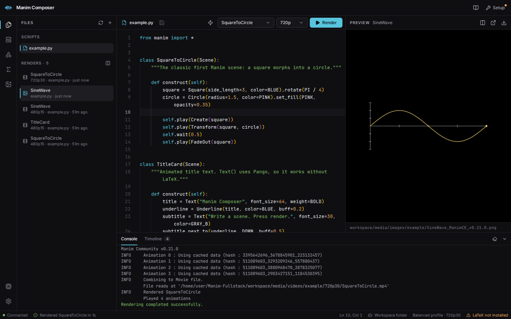

# Manim Composer

A local, browser-based IDE for [Manim Community Edition](https://www.manim.community/). Write a scene, press
<kbd>Ctrl</kbd>+<kbd>Enter</kbd>, and watch it render: live progress, errors that link back to the line that caused
them, and the result playing next to your code.



## Features

- **Editor** — Monaco with Python highlighting, live scene detection, unsaved drafts kept per file,
  <kbd>Ctrl</kbd>/<kbd>⌘</kbd>+<kbd>S</kbd> to save and <kbd>Ctrl</kbd>/<kbd>⌘</kbd>+<kbd>Enter</kbd> to render.
- **Live rendering** — Manim's output streams into the console with per-animation progress
  ("Animation 2 of 4 · Create(Square)"). Cancel at any time. Optional auto-render when you stop typing.
- **Errors that point at code** — traceback lines become links, the failing line gets an editor marker, and a toast
  shows the exception.
- **Preview and compare** — videos and still images (scenes without animations) open in the preview; play any two
  renders side by side in lockstep.
- **Timeline** — every `self.play()` and `self.wait()` in the scene, sized by duration, highlighted while it renders.
- **Helpers** — ready-to-render templates, a shape builder that writes the code for you, a KaTeX-powered LaTeX
  sandbox, and an asset library (images, SVG, audio, fonts) that inserts the code to load each file.
- **Setup guide** — detects Manim, LaTeX, and FFmpeg, shows install commands for your OS, and can run the installers
  for you on Windows.
- **Works offline** — the editor, fonts, and math rendering are bundled; nothing loads from a CDN.

## Quick start

You need **Python 3.11+** and **Node.js 20.19+**. On Linux, Manim also needs the Cairo and Pango headers
(`sudo apt install build-essential pkg-config libcairo2-dev libpango1.0-dev python3-dev`); on macOS, `brew install cairo pkg-config`.
Debian and Ubuntu call the interpreter `python3`.

```bash
git clone https://github.com/birol-dev/Manim-Fullstack.git
cd Manim-Fullstack
python3 -m venv .venv
source .venv/bin/activate          # Windows: .venv\Scripts\activate
pip install -r backend/requirements.txt   # includes Manim CE
python run.py                      # or: python3 run.py
```

`run.py` builds the frontend the first time (and again whenever its sources change), starts the server on
<http://localhost:8000>, and opens your browser. On Windows you can double-click `start.bat` instead.

| Option         | Effect                                   |
| -------------- | ---------------------------------------- |
| `--port 9000`  | Use another port                         |
| `--host`       | Interface to bind (default `127.0.0.1`)  |
| `--no-browser` | Don't open a browser window              |
| `--build`      | Force a fresh frontend build             |

**Optional extras:** a LaTeX distribution (MiKTeX or TeX Live) for `MathTex`, `Tex`, and numbered axes; FFmpeg only for
scenes that use `add_sound`. Manim 0.19+ encodes video on its own.

Scripts live in `workspace/`, uploads in `workspace/assets/`, and renders in `workspace/media/`. If you prefer, switch
**Settings → Scripts** to *Browser* to keep scripts in the browser's local storage instead.

## Development

Run the API with auto-reload and the Vite dev server side by side:

```bash
uvicorn backend.main:app --reload --reload-dir backend --port 8000   # terminal 1
cd frontend && npm install && npm run dev                             # terminal 2 → http://localhost:5173
```

The dev server proxies `/api`, `/media`, and `/assets` to the backend (override with `MANIM_BACKEND_URL`), so the
app always talks to its own origin.

```bash
npm test              # backend (pytest) + frontend (Vitest) with coverage
npm run check         # frontend lint + typecheck + build, backend import check
```

See [PROJECT_REFERENCE.md](PROJECT_REFERENCE.md) for the architecture, REST API, and render protocol, and
[CONTRIBUTING.md](CONTRIBUTING.md) for conventions.

## Docker

The image bundles the backend, Manim, and the built frontend (LaTeX is left out to keep it small):

```bash
docker build -t manim-composer -f backend/Dockerfile .
docker run -p 127.0.0.1:8000:8000 manim-composer
```

Publish on **127.0.0.1** only. `docker run -p 8000:8000` listens on every interface with no login, and anyone who can open that port can run Python. The process inside the container is not root. Containers use the low-resource *eco* profile and disable the installer endpoints. Set `MANIM_ALLOW_LAN=1` only when you mean to expose it on a trusted network.

## Configuration

| Variable                | Default                 | Purpose                                                              |
| ----------------------- | ----------------------- | -------------------------------------------------------------------- |
| `MANIM_ALLOWED_ORIGINS` | —                       | Extra browser origins allowed to use the API, e.g. `https://manim.example.com` (comma separated, `*` for any). Needed when you open the app through a domain name. |
| `MANIM_DEV_ORIGIN_PORTS` | `5173,8000`          | Loopback ports that may call the API besides the server's own port. A page on any other localhost port is refused. |
| `MANIM_ALLOW_LAN`       | off                     | Set to `1` to accept IP-address hosts and non-loopback clients. That is remote code execution for anyone who can reach the port. |
| `MANIM_MAX_CONCURRENT_RENDERS` | `1`            | How many Manim processes may run at once. The default is one, so renders don't overwrite each other's files. |
| `MANIM_RENDER_TIMEOUT`  | `600`                   | Seconds before a render is stopped                                   |
| `MANIM_MAX_CODE_BYTES`  | `2097152`               | Largest script the API accepts, measured as UTF-8. Reported to the UI as `max_code_bytes` by `/api/diagnostics`. |
| `MANIM_MAX_REQUEST_BYTES` | 6 × code limit + 64 KB | Raw request body / WebSocket message cap (room for JSON escaping) |
| `MANIM_TEMP_DOWNLOAD_TTL` | `3600`               | Seconds before an unfetched download-only render is removed          |
| `MANIM_HOST` / `MANIM_PORT` | `127.0.0.1` / `8000` | Address for `npm run backend` / `python backend/main.py` (or pass `--host` / `--port`, which win). The port must be an integer 1–65535 (otherwise exit status 2); a host other than `127.0.0.1`/`localhost`/`::1` prints the same LAN warning as `run.py`, and a port that is already in use stops it before startup. |
| `MANIM_ALLOW_INSTALLS`  | enabled                 | Set to `0` to disable the installer endpoints                        |
| `MANIM_BACKEND_URL`     | `http://127.0.0.1:8000` | Backend the Vite dev server proxies to                               |
| `VITE_BACKEND_URL`      | same origin             | Build-time: point a separately hosted frontend at a backend          |

## Security

The server executes the Python you send it, so treat it like a terminal. It listens on `127.0.0.1` by default.
Browser pages on other sites are refused, and so is a page on some other localhost port (only the server's own
port, Vite's 5173, and origins you list are trusted). IP-address hosts are refused unless `MANIM_ALLOW_LAN=1`.
Requests with no Origin (curl, scripts) are allowed from the local machine. Don't expose the port on an untrusted network.

## Project layout

```text
backend/         FastAPI server: file API, diagnostics, render WebSocket
  main.py          routes and render orchestration
  executor.py      runs Manim, parses its output into events
  scene_parser.py  finds Scene classes and their play()/wait() timeline
  origins.py       which browser origins may talk to the server
frontend/        React + TypeScript app (Vite, Tailwind CSS v4, Radix UI, Monaco)
  src/hooks/       workspace, render session, diagnostics, logs
  src/components/  layout, editor, preview, console, sidebar panels, dialogs
  src/lib/         API client, templates, code generators, formatting
tests/           backend tests (pytest), including real renders when Manim is installed
website/         project landing page (static)
workspace/       your scripts, assets, and renders
run.py           one-command launcher
```

## License

[MIT](LICENSE)
